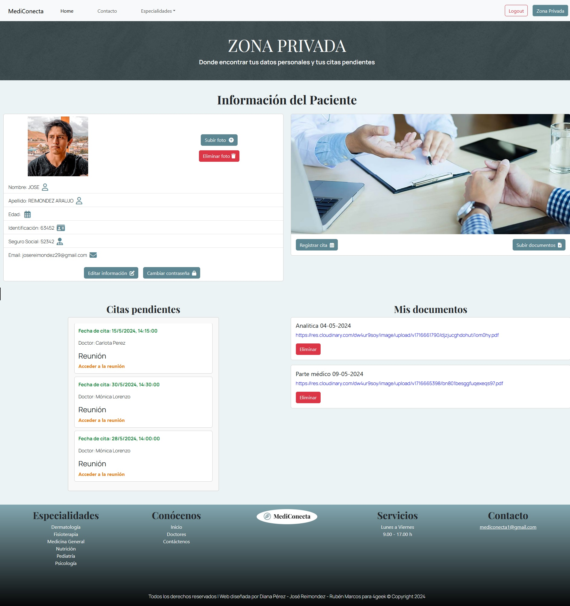
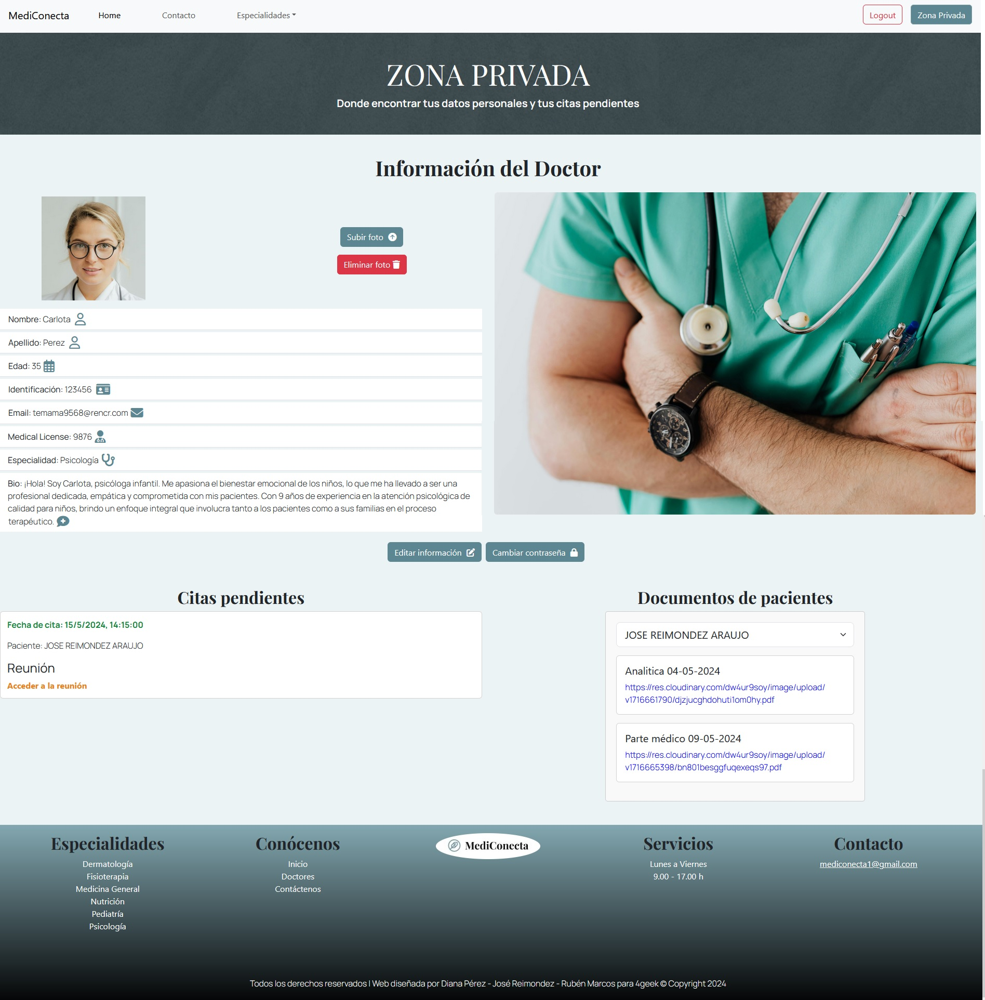

<<<<<<< HEAD

# 🩺 MEDICONECTA 

Mediconecta es una página web destinada a la gestión de citas médicas que incluye funciones como el envío de emails automáticos, recuperación de contraseña, carga de documentos y acceso a videoconferencia.

## 🛠 Herramientas
Bootstrap, Cloudinary, CSS, Figma, HTML, JavaScript, Phyton, React.js, sqlAlchemy, Whereby.

## 🏥 Sobre el proyecto
- **HOME**
  - Aquí encontramos un resumen de la web en general, pudiendo ver y acceder a las especialidades que tenemos, parte de los médicos asistenciales del equipo médico y  el contacto.
  
- **CONTACTO**
  - Hay una opción para contactar con el soporte de dicha web por si hay dudas, quejas, sugerencias por parte de los usuarios del servicio.
  
- **ESPECIALIDADES**
  - En este apartado podemos encontrar un breve resumen de los servicios que se pueden esperar de una consulta online, en cada sección podemos acceder a los médicos que practican la misma y a su vez, acceder a la información más detallada de dichos médicos.
  
- **REGISTRO Y AUTENTIFICACIÓN**
   - Registro de usuario ya sea paciente o médico y proporcionar información personal, tras el registro, recibe un email de bienvenida.
   - Si el usuario se olvida de la contraseña puede solicitar un reseteo de la misma, recibiendo un email con una contraseña aleatoria.
   - Una vez logueado puede cambiar la contraseña de nuevo.
   
- **GESTIÓN DE CITAS/CONSULTA ONLINE**
   - Los pacientes registrados podrán acceder para pedir cita con el médico de su elección y recibirán un correo recordatorio con el enlace para acceder a su consulta.
   
- **MANEJO DE DOCUMENTOS**
   - Los usuarios pacientes pueden cargar documentos médicos relevantes a través de un formulario desde su perfil.
   - El acceso a dichos documentos está también habilitado para el médico en el caso que lo necesite, pueda leerlos antes de la consulta.
   
- **SEGURIDAD**
   - No se puede acceder a los perfiles de otros sin la autentificación necesaria.

- **RESPONSIVE**

## Demo

## Vista previa de los perfiles
**Zona Privada Paciente**

**Zona Privada Doctor**

## Autores

- 👨🏻‍💻[@RubenMP](https://github.com/rubenmp92)
- 🦊[@DianaPF](https://github.com/KitsuneDai)
- 👨🏽‍💻[@JoseRA](https://github.com/josereimondez29)

